<!-- # Opa! Sou o Gabriel Diniz👋 -->
<!--
**gbdiniz/gbdiniz** is a ✨ _special_ ✨ repository because its `README.md` (this file) appears on your GitHub profile.

Here are some ideas to get you started:
- 👯 I’m looking to collaborate on ...
- 🤔 I’m looking for help with ...
- 💬 Ask me about ...
- 📫 How to reach me: ...
- 😄 Pronouns: ...
- ⚡ Fun fact: ...

-->
<!-- - 🔭 Hoje, eu trabalho com Laravel e Flutter.
- 🌱 Estou me aprofundando em Laravel e PHP. -->

  

  

  <!--  -->

